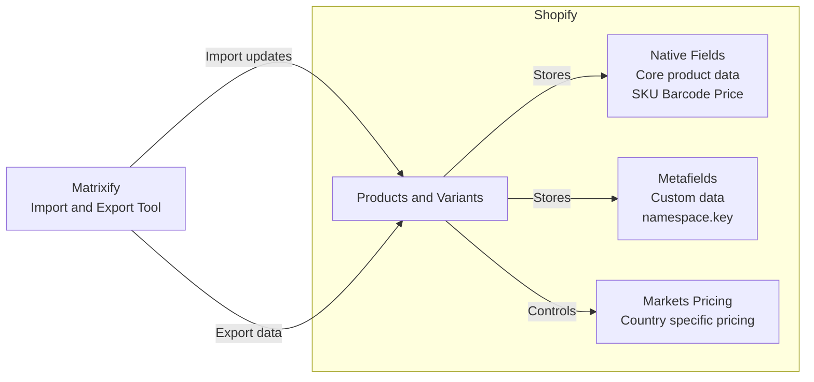

## Documentation

- [Metafields & Native Fields](docs/metafields.md)
- [Markets Pricing](docs/markets-pricing.md)
- [Matrixify Import Rules](docs/matrixify-imports.md)

## 🧠 Executive Summary

Shopify stores product data in three primary ways:

- **Native fields** → Core data Shopify and apps expect
- **Metafields** → Custom data when no native field exists
- **Markets pricing** → Country-specific prices and availability

**Matrixify** is the tool used to safely import and export this data at scale.

Most issues occur when data is placed in the wrong field or when imports are run with incorrect commands.  
This documentation exists to prevent those issues.

---

## ⚠️ Common Failure Modes (and Why We’re Careful)

Most Shopify data issues fall into a few categories:

- **Using metafields instead of native fields**  
  Breaks feeds, reporting, and app integrations

- **Incorrect Matrixify command values**  
  Can unintentionally create duplicate products

- **Assuming metafields control pricing**  
  Markets pricing is controlled separately

- **Leaving legacy Magento metafields in place**  
  Creates confusion without providing value

This documentation exists primarily to prevent these scenarios.

---

## 🧭 Quick Decision Guide

| Question | Correct Action |
|--------|----------------|
| Does Shopify already have a native field? | Use the native field |
| Is this extra data Shopify doesn’t support? | Use a metafield |
| Is pricing market-specific? | Use Markets pricing columns |
| Updating an existing product? | Include `ID` + `UPDATE` |
| Creating a brand-new product? | Use `Handle` + `NEW` |

---

## 🏗️ Shopify Metafields & Matrixify — Overview

### What Is a Metafield?

A **metafield** is a place to store extra information that Shopify does not already provide a native field for.

A simple way to think about it:

> *“I need to store something specific, and Shopify didn’t give me a box for it.”*

---

### Metafield Structure (Namespace / Key)

Every metafield follows a **namespace + key** structure.

**Example**

- **Namespace:** `scp`
- **Key:** `short_description`

This structure helps group related data and prevents naming conflicts.

---

### Naming Conventions (Suggested Best Practice)

Use stable, purpose-based namespaces, for example:

- `spec.` → Technical specifications
- `ops.` → Internal operations
- `seo.` → Search and display content

> *(We didn’t historically do this consistently.)*

---

## 🧩 Types of Metafields

### 1️⃣ Product (Parent) Metafields

Store data that applies to the **product as a whole**, not individual variants.

**Examples**
- Short description
- Marketing copy shared across all sizes

**Matrixify export format**

Metafield: scp.short_description

---

### 2️⃣ Variant Metafields

Store data that varies **by variant**.

**Examples**
- Weight (a size 39 weighs less than a 47)
- Variant-specific attributes

**Matrixify export format**

Variant Metafield: scp.ca_origin_price

---

### ❗ Important Note: Native Fields vs Metafields

Values such as **UPC, SKU, Color, and Size** are **not metafields**.  
Shopify already supports these values natively.

**Examples of native Shopify fields**
- SKU
- UPC / Barcode
- Size
- Color

**Key Rule**
> If Shopify already has a native field, data should live there — not in a metafield.

**Why this matters**
- Shopify and most apps expect data in native fields
- Reporting, search, and feeds (e.g. Google Merchant) pull native fields automatically
- Using metafields for native data creates inconsistencies

**Example**
Even though we have:
Metafield: scp.upc

The correct Shopify native field is:

Variant Barcode

---

## 🧱 Unstructured Metafields

Unstructured metafields are metafields that **do not have formal definitions** in Shopify.

Shopify documentation outlines important considerations here:  
https://help.shopify.com/en/manual/custom-data/metafields/metafield-definitions/migrating-metafields-to-a-definition#considerations

At SNA, these typically fall into two categories:

- Leftovers from early Magento migration attempts
- Metafields created and managed by third-party apps

**Examples**
Variant Metafield: magento.short_description
judgeme.badge

These often persist even if they are no longer actively used.  
We currently have many `magento.*` metafields.

---

## 📤 How Metafields Appear in Matrixify Exports

In Matrixify exports, metafields include:

- Scope (Product or Variant)
- Namespace
- Key
- Data type

**Examples**
Metafield: scp.short_description [multi_line_text_field]
Variant Metafield: scp.origin_price [single_line_text_field]

---

## ✅ Shopify Metafield Best Practices

- Every metafield should have a clear purpose
- If the answer to *“Why does this exist?”* is:

  > *“We might need it someday”*

  …then it probably doesn’t need to exist yet.

---

## 🌎 Markets & Pricing (United States vs Canada)

SNA sells in both the United States and Canada, but **pricing does not live in metafields**.

Even though we have:
Variant Metafield: scp.ca_origin_price
Variant Metafield: scp.origin_price

These fields are **not used** for pricing imports or frontend pricing display.

---

### 🇨🇦 How Canadian Pricing Works in Shopify

Canadian pricing is controlled by two required Matrixify columns:

- `Included / Canada` → Boolean (`TRUE`)
- `Price / Canada` → Actual CAD price

Both columns must be populated for fixed Canadian pricing to import correctly.

If no fixed Canadian price exists, Shopify converts the U.S. price for the Canadian storefront.

---

### 🇺🇸 United States Pricing

The same logic applies to the U.S. market:

- `Included / United States` → Boolean (`TRUE`)
- `Price / United States` → Actual U.S. price

---

## 📦 Matrixify Import Guide (Abbreviated)

When configuring imports via Matrixify, we primarily use:

- **Native Shopify columns** (e.g. `Variant Barcode`)
- **Defined product metafields** (e.g. `Metafield: scp.xxx`)

**Additional notes**
- `scp` is the namespace used for supported metafields
- We do not currently rely on variant metafields for imports
- `magento.*` metafields appear in exports but are not actively used

---

## ✋ Manual vs Import Updates

Some data is faster and safer to manage directly in Shopify rather than via import, especially when formatting or validation is strict (e.g. metaobjects or list fields).

In these cases, manual updates reduce risk and save time.

---

## 🔄 Matrixify Import Guide: Handle & Command

### How Matrixify Matches Products

When exporting product data, Matrixify includes an **ID** column.

- The ID is Shopify’s internal product identifier
- If an import includes an ID, Matrixify will always match and update that exact product
- This is the safest way to update existing products

---

### What Happens Without an ID

If no ID is present, Matrixify falls back to the **Handle**.

- The handle defines the product’s URL (PDP)
- Matrixify uses the handle to determine whether to create or update a product
- The Handle and Command columns must be used together correctly

---

### Handle + Command Behavior

**Updating an existing product**
Handle: drago-xt
Command: UPDATE

Result:  
The existing *Drago XT* product is updated.

**Incorrect command**
Handle: drago-xt
Command: NEW

Result:  
A second *Drago XT* product is created, resulting in a duplicate PDP.

---

## 🧠 Key Takeaways

- Use **ID** whenever possible when updating existing products
- If no ID is present:
  - Ensure the handle matches the existing product
  - Use the correct command value
- Incorrect commands can unintentionally create duplicate products

---

## 📚 Reference Documentation

Matrixify product documentation:  
https://matrixify.app/documentation/products/

## Readme Version

