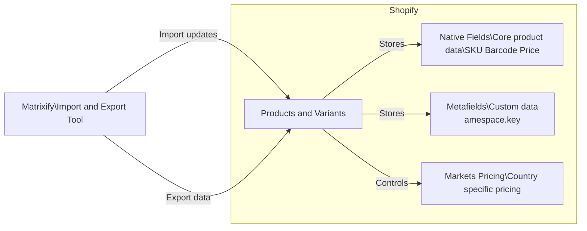

## 🧠 Executive Summary

Shopify stores product data in three primary ways:

- **Native fields** → Core data Shopify and apps expect
- **Metafields** → Custom data when no native field exists
- **Markets pricing** → Country-specific prices and availability

## Documentation

- [Metafields & Native Fields](docs/metafields.md)
- [Markets Pricing](docs/markets-pricing.md)
- [Matrixify Import Rules](docs/matrixify-imports.md)

**Matrixify** is the tool used to safely import and export this data at scale.

Most issues occur when data is placed in the wrong field or when imports are run with incorrect commands.  
This documentation exists to prevent those issues.

---

## ⚠️ Common Failure Modes (and Why We’re Careful)

Most Shopify data issues fall into a few categories:

- **Using metafields instead of native fields**  
  Breaks feeds, reporting, and app integrations

- **Incorrect Matrixify command values**  
  Can unintentionally create duplicate products

- **Assuming metafields control pricing**  
  Markets pricing is controlled separately

- **Leaving legacy Magento metafields in place**  
  Creates confusion without providing value

This documentation exists primarily to prevent these scenarios.

---

## 🧭 Quick Decision Guide

| Question | Correct Action |
|--------|----------------|
| Does Shopify already have a native field? | Use the native field |
| Is this extra data Shopify doesn’t support? | Use a metafield |
| Is pricing market-specific? | Use Markets pricing columns |
| Updating an existing product? | Include `ID` + `UPDATE` |
| Creating a brand-new product? | Use `Handle` + `NEW` |

---

## 📚 Reference Documentation

Matrixify product documentation:  
https://matrixify.app/documentation/products/

## How Data Moves Around

## 📄 License

This project is licensed under the MIT License. See the LICENSE file for details.
