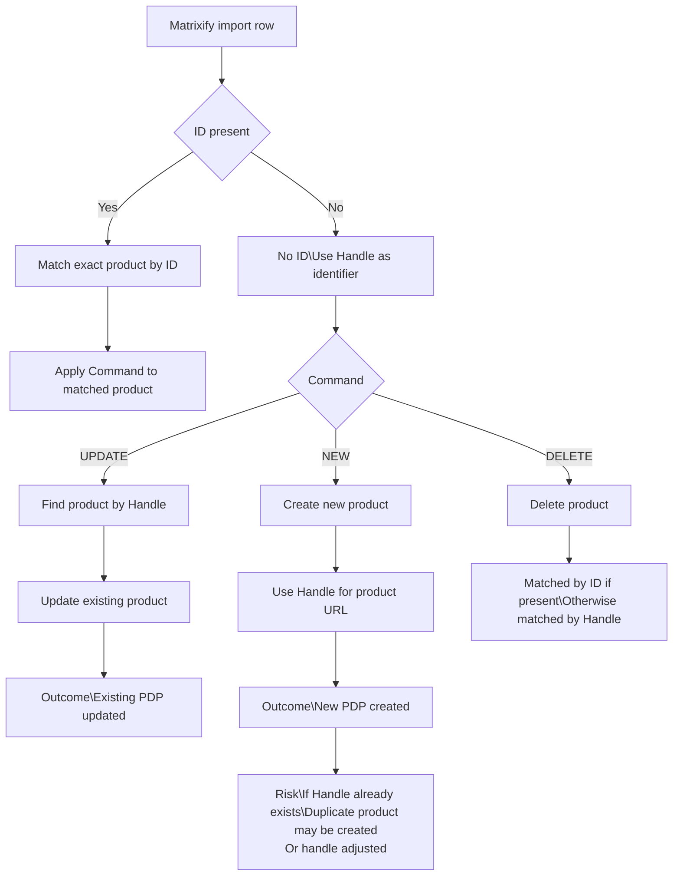

## 🔄 Matrixify Import Guide: Handle & Command

### How Matrixify Matches Products

When exporting product data, Matrixify includes an **ID** column.

- The ID is Shopify’s internal product identifier
- If an import includes an ID, Matrixify will always match and update that exact product
- This is the safest way to update existing products

---

### What Happens Without an ID

If no ID is present, Matrixify falls back to the **Handle**.

- The handle defines the product’s URL (PDP)
- Matrixify uses the handle to determine whether to create or update a product
- The Handle and Command columns must be used together correctly

---

### Handle + Command Behavior

**Updating an existing product**
Handle: drago-xt
Command: UPDATE

Result:  
The existing *Drago XT* product is updated.

**Incorrect command**
Handle: drago-xt
Command: NEW

Result:  
A second *Drago XT* product is created, resulting in a duplicate PDP.

---

## 🧠 Key Takeaways

- Use **ID** whenever possible when updating existing products
- If no ID is present:
  - Ensure the handle matches the existing product
  - Use the correct command value
- Incorrect commands can unintentionally create duplicate products

---

## 📚 Reference Documentation

Matrixify product documentation:  
https://matrixify.app/documentation/products/
