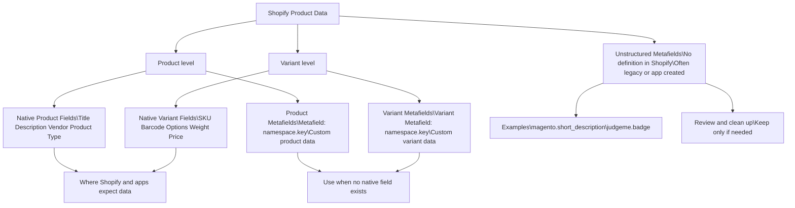

## 🏗️ Shopify Metafields & Matrixify — Overview

### What Is a Metafield?

A **metafield** is a place to store extra information that Shopify does not already provide a native field for.

A simple way to think about it:

> *“I need to store something specific, and Shopify didn’t give me a box for it.”*

---

### Metafield Structure (Namespace / Key)

Every metafield follows a **namespace + key** structure.

**Example**

- **Namespace:** `scp`
- **Key:** `short_description`

This structure helps group related data and prevents naming conflicts.

---

### Naming Conventions (Suggested Best Practice)

Use stable, purpose-based namespaces, for example:

- `spec.` → Technical specifications
- `ops.` → Internal operations
- `seo.` → Search and display content

> *(We didn’t historically do this consistently.)*

---

## 🧩 Types of Metafields

### 1️⃣ Product (Parent) Metafields

Store data that applies to the **product as a whole**, not individual variants.

**Examples**
- Short description
- Marketing copy shared across all sizes

**Matrixify export format**

Metafield: scp.short_description

---

### 2️⃣ Variant Metafields

Store data that varies **by variant**.

**Examples**
- Weight (a size 39 weighs less than a 47)
- Variant-specific attributes

**Matrixify export format**

Variant Metafield: scp.ca_origin_price

---

### ❗ Important Note: Native Fields vs Metafields

Values such as **UPC, SKU, Color, and Size** are **not metafields**.  
Shopify already supports these values natively.

**Examples of native Shopify fields**
- SKU
- UPC / Barcode
- Size
- Color

**Key Rule**
> If Shopify already has a native field, data should live there — not in a metafield.

**Why this matters**
- Shopify and most apps expect data in native fields
- Reporting, search, and feeds (e.g. Google Merchant) pull native fields automatically
- Using metafields for native data creates inconsistencies

**Example**
Even though we have:
Metafield: scp.upc

The correct Shopify native field is:

Variant Barcode

---

## 🧱 Unstructured Metafields

Unstructured metafields are metafields that **do not have formal definitions** in Shopify.

Shopify documentation outlines important considerations here:  
https://help.shopify.com/en/manual/custom-data/metafields/metafield-definitions/migrating-metafields-to-a-definition#considerations

At SNA, these typically fall into two categories:

- Leftovers from early Magento migration attempts
- Metafields created and managed by third-party apps

**Examples**
Variant Metafield: magento.short_description
judgeme.badge

These often persist even if they are no longer actively used.  
We currently have many `magento.*` metafields.

---
## ➡️Diagram of Metafield Usage

---

## 📤 How Metafields Appear in Matrixify Exports

In Matrixify exports, metafields include:

- Scope (Product or Variant)
- Namespace
- Key
- Data type

**Examples**
Metafield: scp.short_description [multi_line_text_field]
Variant Metafield: scp.origin_price [single_line_text_field]

---

## ✅ Shopify Metafield Best Practices

- Every metafield should have a clear purpose
- If the answer to *“Why does this exist?”* is:

  > *“We might need it someday”*

  …then it probably doesn’t need to exist yet.

